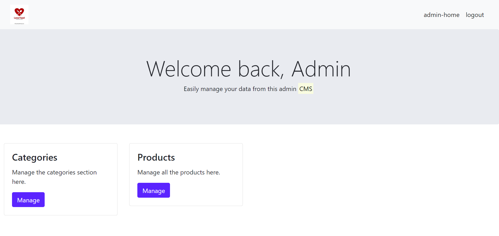

# FullStackJavaProject
<h3>Food box is a restaurant chain that delivers food items of different cuisines at affordable 
prices. They have decided launch an online food delivery web application with a rich and 
user-friendly interface. The system provides different functionalities for admin and non-admin 
users. Admin user is able to manage products, while any registered user can view menu, 
select items and checkout the items added to the cart.</h3>
<h1>Technologies Used :-</h1>
<h3>Frontend:- Bootstrap,Thymeleaf 
    Backend:- Spring Boot 
    Database:- Mysql 
    Automation and testing technologies:- Selenium and TestNG 
    DevOps and production technologies: Git, GitHub, Jenkins, Docker,AWS EC2</h3>
<h1>Admin home page Screenshot:-</h1>

